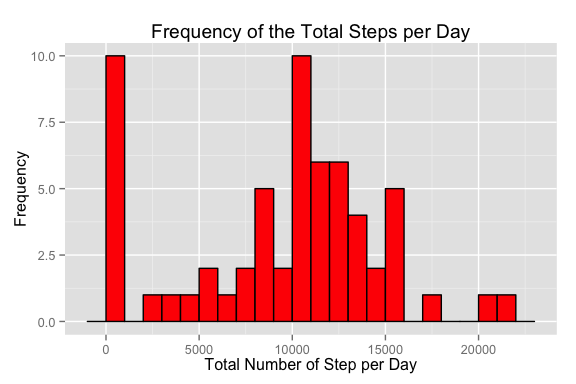
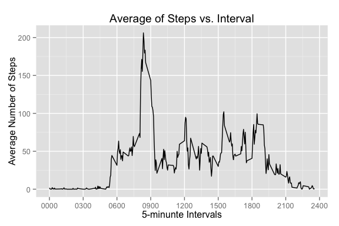
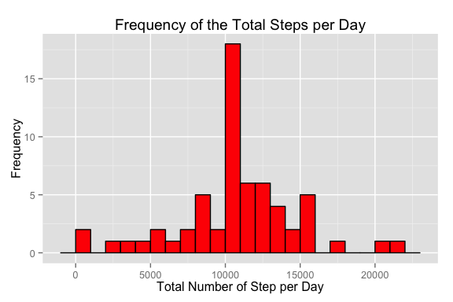
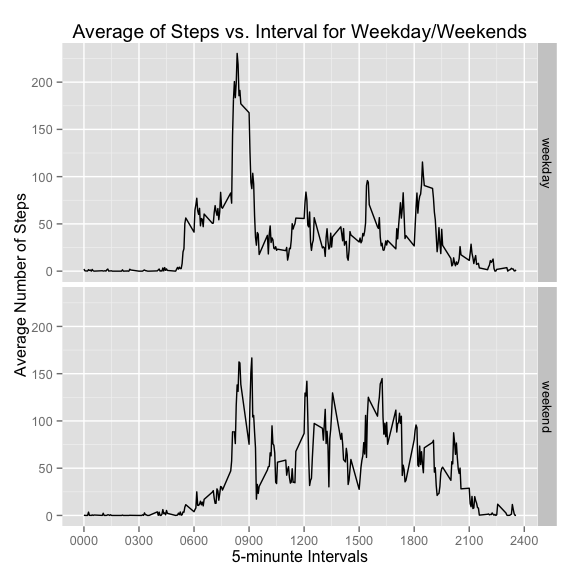

# Reproducible Research: Peer Assessment 1

## Loading the required libraries
This script uses three loadable libraries

1. The data.table package used for storing and processing the data.
2. The ggplot2 package used for the ploting of figures.
3. The lubridate package used to process dates.


```r
library(data.table)
options(datatable.print.topn=2)
library(ggplot2)
library(lubridate)
```

```
## 
## Attaching package: 'lubridate'
## 
## The following objects are masked from 'package:data.table':
## 
##     hour, mday, month, quarter, wday, week, yday, year
```

## Loading and preprocessing the data
Loads the data into a data.table and converts the date column into a date type, and steps column to numeric.


```r
data <- fread("activity.csv")
data[,`:=`(date=ymd(date), steps=as.numeric(steps))]
```

```
##        steps       date interval
##     1:    NA 2012-10-01        0
##     2:    NA 2012-10-01        5
##    ---                          
## 17567:    NA 2012-11-30     2350
## 17568:    NA 2012-11-30     2355
```

Print a summary of the data.


```r
summary(data)
```

```
##      steps            date               interval   
##  Min.   :  0.0   Min.   :2012-10-01   Min.   :   0  
##  1st Qu.:  0.0   1st Qu.:2012-10-16   1st Qu.: 589  
##  Median :  0.0   Median :2012-10-31   Median :1178  
##  Mean   : 37.4   Mean   :2012-10-31   Mean   :1178  
##  3rd Qu.: 12.0   3rd Qu.:2012-11-15   3rd Qu.:1766  
##  Max.   :806.0   Max.   :2012-11-30   Max.   :2355  
##  NA's   :2304
```

*Comment: from the data summary the minimum and maximum of both date and interval columns can be determined, and that there is a number of missing values from the steps column.*


## What is mean total number of steps taken per day?

### Sum the steps on a per day basis removing missing data


```r
stepsPerDay <- data[, .(sumSteps = sum(steps, na.rm=TRUE)), keyby="date"]
stepsPerDay[1:4]
```

```
##          date sumSteps
## 1: 2012-10-01        0
## 2: 2012-10-02      126
## 3: 2012-10-03    11352
## 4: 2012-10-04    12116
```

### Plot the frequency of total steps per day


```r
ggplot(stepsPerDay, aes(x=sumSteps)) +
    geom_bar(fill="red", colour="black", binwidth=1000) +
    labs(title="Frequency of the Total Steps per Day",
         x="Total Number of Step per Day",
         y="Frequency")
```

 

*Comment: the histogram shows a skew in the data caused by a peak in the lowest bin range.*

### Calculate the mean/median of the steps per day.


```r
statsPerDay <- stepsPerDay[, .(meanSteps = mean(sumSteps), medianSteps = median(sumSteps))]
statsPerDay
```

```
##    meanSteps medianSteps
## 1:      9354       10395
```

*Comment: the mean and medium values reinforce the data skew shown in the histogram*

## What is the average daily activity pattern?

### Average number of steps per interval removing missing data 


```r
stepsPerInterval <- data[, .(meanSteps = mean(steps, na.rm=TRUE)), keyby="interval"]
stepsPerInterval[1:4]
```

```
##    interval meanSteps
## 1:        0    1.7170
## 2:        5    0.3396
## 3:       10    0.1321
## 4:       15    0.1509
```

### Plot the average number of the steps against the interval.


```r
breaks <- c(0,300,600,900,1200,1500,1800,2100,2400)
labels <- sprintf("%04d", breaks)
ggplot(stepsPerInterval, aes(x=interval, y=meanSteps)) + geom_line() +
            scale_x_continuous(breaks=breaks,labels=labels) +
            labs(title="Average of Steps vs. Interval",
                 x="5-minunte Intervals", y="Average Number of Steps")
```

 

*Comment: there is a very low level of activity from late at night to early in morning as one might expect.  Also a large spike between 0800 and 0915 maybe when a significant number of people are getting up and going to work.*

### Display interval with the maximum average of steps


```r
intervalMaxStep <- stepsPerInterval[which.max(meanSteps)]$interval
sprintf("%04d", intervalMaxStep)
```

```
## [1] "0835"
```

*Comment: the interval of maximum activity occurs approximately in the middle of the early morming acitivity peak.*

## Imputing missing values

### Calculating the number of missing step measurements


```r
missingSteps <- sum(is.na(data$steps))
missingSteps
```

```
## [1] 2304
```

*Comment: this corresponds to the value shown in the data summary in the 'Loading and Preprocessing the data' section.*

### Filling in the missing step measurements

The strategy adopted is to use the mean of available steps measurements within the 5-minute interval to overwrite NA values.

This is achieved in 4 steps.

1. Take a copy of the orignal data
2. Create a intMeanSteps column holding the average of the steps per interval.
3. Where steps is NA overwrite the corresponding value in intMeanSteps.
4. Remove the intMeanSteps column.


```r
adjData <- copy(data)
adjData[, intMeanSteps:= mean(steps, na.rm=TRUE), by=interval][
                    is.na(steps), steps:= intMeanSteps][,intMeanSteps:=NULL]
```

```
##         steps       date interval
##     1: 1.7170 2012-10-01        0
##     2: 0.3396 2012-10-01        5
##    ---                           
## 17567: 0.2264 2012-11-30     2350
## 17568: 1.0755 2012-11-30     2355
```

### Total the steps on a per day basis


```r
adjStepsPerDay <- adjData[, .(sumSteps = sum(steps)), keyby="date"]
adjStepsPerDay[1:4]
```

```
##          date sumSteps
## 1: 2012-10-01    10766
## 2: 2012-10-02      126
## 3: 2012-10-03    11352
## 4: 2012-10-04    12116
```

### Plot the revised frequency of total adjusted steps in a day


```r
ggplot(adjStepsPerDay, aes(x=sumSteps)) + 
    geom_bar(fill="red", colour="black", binwidth=1000) +
        labs(title="Frequency of the Total Steps per Day",
         x="Total Number of Step per Day",
         y="Frequency")
```

 

*Comment: the histogram of the adjusted steps seems to be approximately a symmetric and normal-like distribution.*

### Calculate the mean/median of the adjusted steps per day.


```r
adjStatsPerDay <- adjStepsPerDay[, .(meanSteps = mean(sumSteps),
                                     medianSteps = median(sumSteps))]
meanMedian <- cbind(data.table(data=c("Original", "Adjusted")),
                    rbind(statsPerDay, adjStatsPerDay))
meanMedian
```

```
##        data meanSteps medianSteps
## 1: Original      9354       10395
## 2: Adjusted     10766       10766
```

*Comment: the equality of mean and medium values support the assertion that the distributionof the adjusted step measurements are symmetric.*

## Are there differences in activity patterns between weekdays and weekends?

### Add a weekday/weekend column to the data


```r
adjData[, daytype := factor(ifelse(wday(date) %in% c(1,7), "weekend", "weekday"))]
```

```
##         steps       date interval daytype
##     1: 1.7170 2012-10-01        0 weekday
##     2: 0.3396 2012-10-01        5 weekday
##    ---                                   
## 17567: 0.2264 2012-11-30     2350 weekday
## 17568: 1.0755 2012-11-30     2355 weekday
```

### Average number of steps per daytype and interval


```r
stepsPerIntervalDaytype <- adjData[, .(meanSteps = mean(steps)), by="daytype,interval"]
stepsPerIntervalDaytype[1:4]
```

```
##    daytype interval meanSteps
## 1: weekday        0    2.2512
## 2: weekday        5    0.4453
## 3: weekday       10    0.1732
## 4: weekday       15    0.1979
```

### Plot activity patterns for both weekends and weekdays


```r
ggplot(stepsPerIntervalDaytype, aes(interval,meanSteps)) + geom_line() +
            facet_grid(daytype ~ .) +
            scale_x_continuous(breaks=breaks,labels=labels) +
            labs(title="Average of Steps vs. Interval for Weekday/Weekends",
                 x="5-minunte Intervals", y="Average Number of Steps")
```

 

*Comment: There can be seen a number of differences in the activity pattern in the week and at the weekend.  The weekend pattern shows a later and more gradual increase in early morning activity, there is is still a peak around the same time but the peak is lower, with more activity during the subsequent day.*
